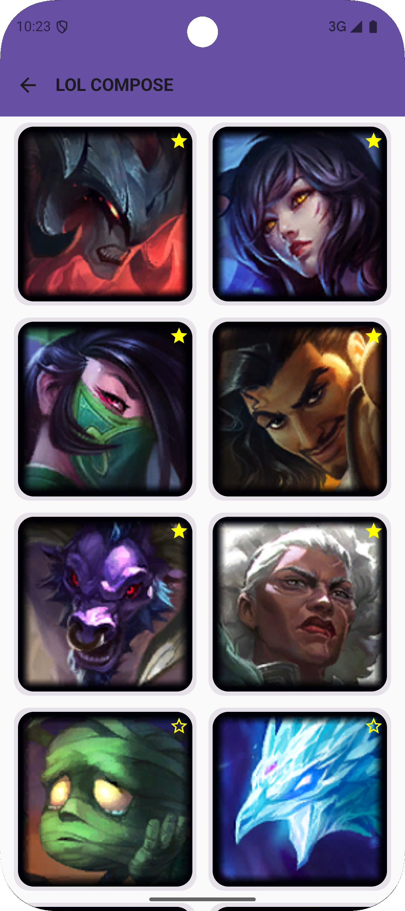
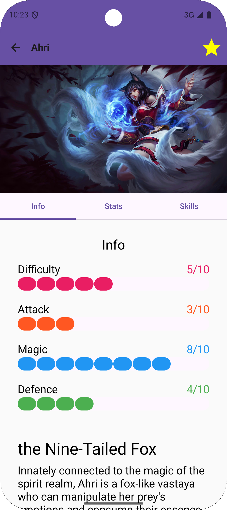
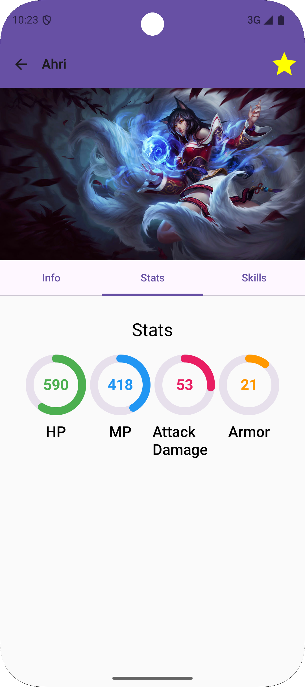
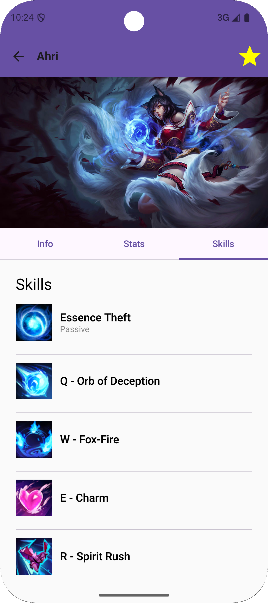

# LoL Champion Info App 🎮

An Android application that provides **detailed League of Legends champion information** with a clean UI, smooth navigation, and offline storage.  
This project was built to demonstrate **modern Android development best practices** and showcases skills in **Compose, MVVM, Hilt, Room, Retrofit, and Coroutines**.

---

## ✨ Key Features
- Browse and search all champions with images and stats
- Mark favorites and manage your list
- View detailed champion pages with abilities and lore
- Responsive layouts (portrait & landscape)
- Smooth navigation transitions with Jetpack Compose

---

## 📸 Screenshots
| Champion List                      | Champion Detail  info tab                 | Champion detail stats tab                      | Champion detail skill tab                    |
|------------------------------------|-------------------------------------------|------------------------------------------------|--------------------------------------------- |
|  |  |     |  |

---

## 🎯 Why This Project?
- Demonstrates **end-to-end Android app development** (UI, data, network, DI)  
- Showcases **Clean Architecture** and **modern Android stack**  
- Built as a personal project to explore **Jetpack Compose and dependency injection**  
- Serves as a portfolio project for mobile engineering roles

---

## 🛠️ Tech Stack & Library

### Minimum Requirements
- **Minimum SDK:** 24 (Android 7.0 Nougat)  
- **Language:** Kotlin  

### Architecture
- **MVVM (Model-View-ViewModel):** Separates UI, business logic, and data layers for better maintainability and testability.  
- **Repository Pattern:** Acts as a mediator between data sources (local DB, network, etc.) and business logic, ensuring consistent data management.  

### Core Libraries
- **Jetpack Compose** – Android’s modern declarative UI toolkit  
  (`androidx.compose.*, material3, foundation, ui, animation, tooling.preview, material.icons.extended, constraintlayout.compose`)  
- **Lifecycle** – Observes Android component lifecycles and manages UI state (`androidx.lifecycle.*`)  
- **ViewModel** – Stores and manages UI-related data across configuration changes (`androidx.lifecycle.viewmodel.*`)  
- **Navigation Compose** – Simplifies navigation and deep linking (`androidx.navigation.compose`)  
- **Room** – Type-safe abstraction layer over SQLite (`androidx.room.*`)  
- **Hilt** – Dependency injection framework (`hilt, hilt.android, androidx.hilt.navigation.compose, kapt(hilt.compiler)`)  
- **Retrofit2** – Type-safe HTTP client (`retrofit, converter.gson`)  
- **OkHttp3** – HTTP client for network communication (`okhttp`)  
- **Gson** – JSON serialization/deserialization (`gson`)  
- **Coil** – Image loading library optimized for Compose (`coil.compose`)  
- **Coroutines & Flow** – Async programming and reactive data (`androidx.lifecycle.runtime.ktx, androidx.room.ktx`)  
- **ConstraintLayout Compose** – Flexible UI layouts (`androidx.constraintlayout.compose`)  

### Open-Source Libraries Used
- Jetpack Compose  
- AndroidX Lifecycle  
- AndroidX Navigation Compose  
- Room  
- Hilt  
- Retrofit2  
- OkHttp3  
- Gson  
- Coil  
- ConstraintLayout Compose  

---

## 📜 License
This project is for **educational and demonstration purposes** only.  
League of Legends and all related assets are © Riot Games.
